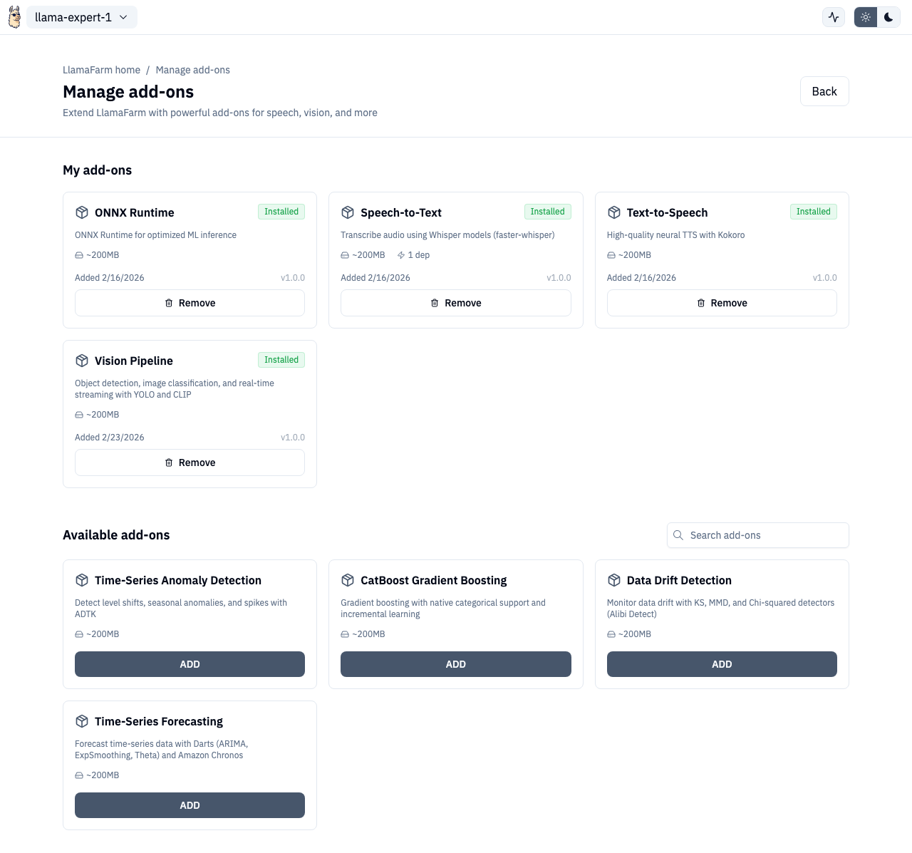

# Addons



Addons extend LlamaFarm with additional ML capabilities. The Addons page lets you browse, install, and manage them.


## Overview

Addons are optional packages that add features like speech-to-text, text-to-speech, vision models, and more. They're managed separately because they can be large downloads and not every project needs them.

## Browsing Addons

The Addons page shows two sections:

- **Installed** — addons currently on your system, with uninstall option
- **Available** — addons you can install

Use the search bar to filter by name or description.

## Installing Addons

1. Click an available addon to open the install side pane
2. Review the addon details (description, size, dependencies)
3. Click **Install**
4. Watch the installation progress with real-time status updates

### Install Progress

The install progress component shows:

- Current step (downloading, extracting, configuring)
- Progress percentage
- Estimated time remaining
- Option to minimize to a floating indicator while you continue working

### Dependency Handling

Some addons depend on others. When uninstalling an addon that other addons depend on, you'll see a warning listing the affected addons.

## API Routes

| Action | Method | Route |
|---|---|---|
| List addons | GET | `/v1/addons` |
| Install addon | POST | `/v1/addons/install` |
| Uninstall addon | POST | `/v1/addons/uninstall` |
| Task status | GET | `/v1/addons/tasks/{task_id}` |

## Route

```
/addons
```
