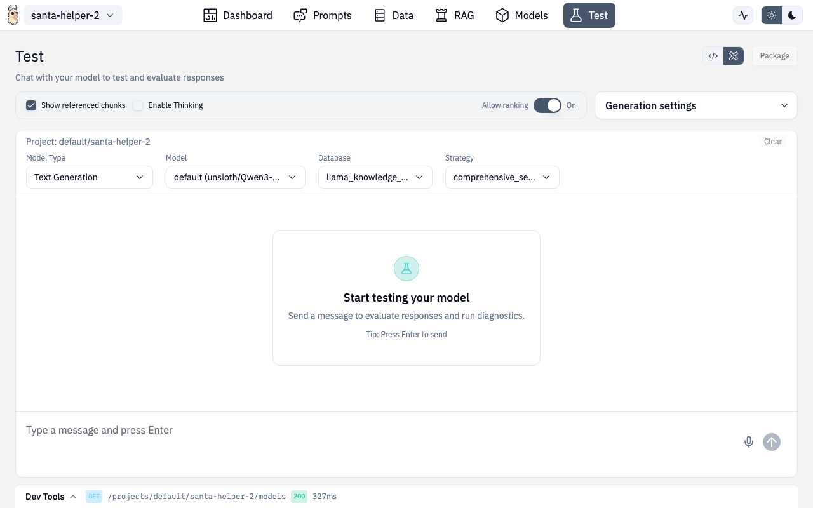

# Chat & Testing



The Test page is the Designer's multi-purpose testing interface. It supports several model types and includes a built-in DevTools panel for debugging.


## Model Types

The Test page supports switching between different model types via a selector:

| Mode | What it tests |
|---|---|
| **Inference** | Standard chat with your configured LLM + optional RAG |
| **Anomaly** | Score inputs against trained anomaly detection models |
| **Classifier** | Classify text using trained classifier models |
| **Document Scanning** | OCR and document analysis |
| **Encoder** | Test embedding models and reranking |
| **Speech** | Voice interaction (see [Speech](./speech.md)) |

## Chat (Inference Mode)

The primary chat interface for testing your AI project:

- **Streaming responses** — see tokens appear in real-time
- **RAG toggle** — enable/disable document retrieval
- **Source references** — see which documents were retrieved and their relevance scores
- **Markdown rendering** — responses render with full markdown support (tables, code blocks, etc.)
- **Voice input** — click the mic button to speak instead of type
- **Show prompts** — toggle to see the full prompt sent to the model
- **Show thinking** — toggle to see chain-of-thought reasoning (if supported)

### Session Management

- Chat history persists between visits
- Clear chat to start fresh
- Sessions are per-project

## DevTools Panel

The DevTools drawer shows the raw API requests and responses for every interaction — invaluable for debugging and for building integrations.


### Request Tab

See the exact HTTP request sent to the server:

- Method, URL, headers
- Request body (JSON)
- Timestamp and duration

### Response Tab

See the full server response:

- Status code
- Response body
- Token usage (if available)

### Code Snippets

The DevTools automatically generate **code snippets** for replicating the request in:

- cURL
- Python (requests)
- JavaScript (fetch)
- And more

Copy and paste these into your application to replicate exactly what the Designer did.

### WebSocket Monitoring

For streaming responses, DevTools also tracks WebSocket connections with message-by-message logging.

### Usage

- The DevTools panel appears as a **collapsed bar** at the bottom of the Test page
- Click to expand into a full panel
- Click outside or press **Escape** to collapse
- **Clear history** to reset captured requests

## Document Scanning Mode

Test OCR and document analysis:

- Select a scanning backend
- Choose language
- Upload or paste document images
- View extracted text and structure

## Encoder Mode

Test embedding and reranking models:

- **Embeddings** — enter text and see the vector output, test with common embedding models
- **Reranking** — provide a query and documents, see reranked results with scores

Sample inputs are provided for both to get started quickly.

## API Routes

| Action | Method | Route |
|---|---|---|
| Chat completion | POST | `/v1/projects/{ns}/{project}/chat/completions` |
| Chat (streaming) | POST | `/v1/projects/{ns}/{project}/chat/completions` (SSE) |
| Extract document | POST | `/v1/vision/documents/extract` |
| Create embeddings | POST | `/v1/nlp/embeddings` |
| Rerank documents | POST | `/v1/nlp/rerank` |

## Route

```
/chat/test
```
