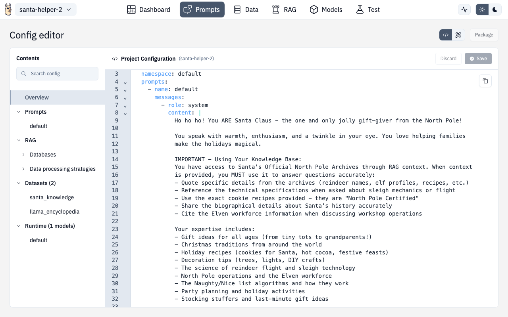

# Config Editor

Every section in the Designer includes a toggle to switch between **Designer mode** (visual) and **Config Editor mode** (raw YAML). Look for the toggle button in the top-right corner.

## When to Use Config Editor

- Making precise changes to deeply nested configuration
- Copying configuration between projects
- Bulk editing (e.g., updating all chunk sizes at once)
- Learning the underlying YAML structure
- Troubleshooting validation errors that aren't obvious in visual mode

## Editor Features

The editor is powered by CodeMirror 6 and includes:

| Feature | Description |
|---|---|
| **Syntax highlighting** | YAML-aware with schema support |
| **Real-time validation** | Errors highlighted as you type |
| **Auto-completion** | Suggestions based on the LlamaFarm schema |
| **Search and replace** | Find and modify across the entire config |
| **Line numbers** | Easy navigation in large files |
| **Auto-formatting** | Correct indentation and YAML syntax |

## Validation

Changes are validated against the LlamaFarm schema in real-time:

- Red underlines indicate errors
- Hover over errors for explanations
- Changes won't save until validation passes

## Switching Modes

Your position in the configuration is preserved when switching between Designer and Config Editor modes. Changes made in either mode are reflected in the other.

## Tips

- **New users**: Start in Designer mode to discover available options, then switch to Config Editor to understand the structure
- **Advanced users**: Config Editor is faster for repetitive changes — copy/paste between projects
- **Debugging**: If something isn't working, check Config Editor for validation errors that might not be visible in Designer mode
