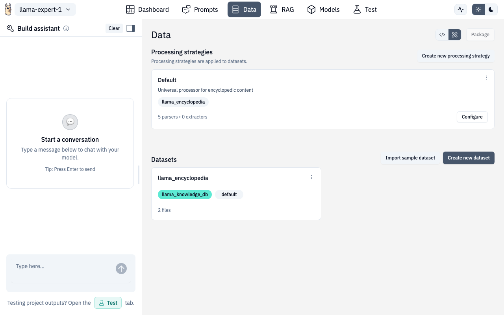

# Data Management

The Data section is where you manage datasets, configure processing strategies, and preview how your documents will be chunked and embedded.


## Processing Strategies

Processing strategies define how uploaded files are parsed, chunked, and embedded. Each strategy includes:

- **Parsers** — how to extract text from different file types (PDF, DOCX, TXT, CSV, Markdown)
- **Extractors** — additional extraction settings (metadata, patterns, custom schemas)
- **Chunking** — how to split documents into pieces (by characters, sentences, or paragraphs)
- **Embedding** — which model creates vector embeddings
- **Storage** — which vector database stores the results

### Managing Strategies

- **View existing strategies** — see all configured strategies as cards
- **Create new** — define a strategy from scratch
- **Copy** — duplicate an existing strategy as a starting point
- **Edit** — click any strategy card to modify its configuration

### Extractor & Parser Settings

The extractor settings form lets you configure:

- Extraction patterns with a visual pattern editor
- Custom extraction schemas
- Metadata extraction rules

Parser settings control file-type-specific behavior like PDF table extraction, CSV delimiter handling, and markdown header parsing.

## Datasets

Below the strategies, you'll find your datasets:

- **Create dataset** — name it, select a processing strategy and database
- **Upload files** — drag and drop or click to browse
- **Process** — kick off ingestion after uploading
- **View details** — click a dataset to see files, metadata, and processing status
- **Delete** — remove a dataset via the dropdown menu

### Supported File Types

| Format | Extensions |
|---|---|
| PDF | `.pdf` |
| Word | `.docx` |
| Text | `.txt` |
| CSV | `.csv` |
| Markdown | `.md`, `.markdown` |

## Document Preview

After processing, you can preview how any document was chunked using the **Document Preview** modal.



The preview shows two side-by-side panels:

- **Original Document** — the source file as-is
- **Processed Chunks** — how the document was split, with chunk boundaries highlighted

You can:

- Switch between different processing strategies to compare results
- Click individual chunks to see their content and metadata
- Verify that chunking boundaries make sense for your use case

### API Routes

| Action | Method | Route |
|---|---|---|
| List datasets | GET | `/v1/projects/{ns}/{project}/datasets` |
| Create dataset | POST | `/v1/projects/{ns}/{project}/datasets` |
| Upload files | POST | `/v1/projects/{ns}/{project}/datasets/{dataset}/data` |
| Process dataset | POST | `/v1/projects/{ns}/{project}/datasets/{dataset}/actions` |
| Preview document | POST | `/v1/projects/{ns}/{project}/rag/databases/{database_name}/preview` |

## Route

```
/chat/data
/chat/data/:datasetId
```
