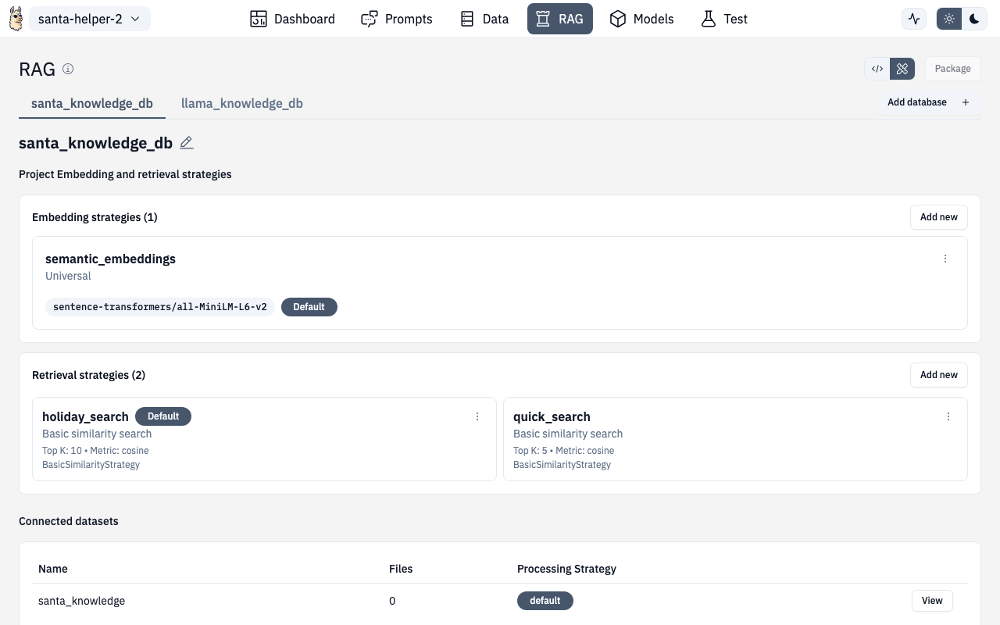

# Databases (RAG Configuration)



The Databases section is where you configure Retrieval-Augmented Generation — vector databases, embedding models, and retrieval strategies.


## Vector Databases

Create and manage vector databases:

- **ChromaDB** (default) — local vector storage, zero configuration
- **Pinecone**, **Weaviate**, etc. — cloud-hosted options

Each database needs a unique name and storage configuration (connection details for hosted options).

## Embedding Strategies

Configure how text is converted to vectors:

| Setting | Description |
|---|---|
| **Embedding model** | Which model creates embeddings (e.g., `nomic-embed-text`) |
| **Chunk size** | How large each embedded piece should be |
| **Overlap** | How much chunks overlap to preserve context |

### Changing Embedding Models

The **Change Embedding Model** page lets you switch models for a database. This will re-embed all documents, which can take time for large datasets.

### Adding Embedding Strategies

Create new embedding strategies with custom chunk sizes, overlap, and model selection. Local models are shown in a table with download status.

## Retrieval Strategies

Define how relevant documents are found when querying:

| Method | Description |
|---|---|
| **Similarity Search** | Pure vector similarity (default) |
| **Hybrid Search** | Combines vector + keyword matching (BM25) |
| **MMR** | Maximal Marginal Relevance — balances relevance with diversity |
| **Metadata Filtering** | Filter by document properties before similarity search |

### Managing Strategies

- **Add** — create a new retrieval strategy
- **Edit** — modify parameters like top-k, score threshold, or filters
- **View** — see the full strategy configuration

### Testing Queries

Use the built-in query tester to:

1. Enter a test question
2. See which documents are retrieved
3. Check relevance scores and ranking
4. Adjust parameters if needed

## API Routes

| Action | Method | Route |
|---|---|---|
| List databases | GET | `/v1/projects/{ns}/{project}/rag/databases` |
| Create database | POST | `/v1/projects/{ns}/{project}/rag/databases` |
| RAG query | POST | `/v1/projects/{ns}/{project}/rag/query` |
| RAG health | GET | `/v1/projects/{ns}/{project}/rag/health` |

## Route

```
/chat/databases
/chat/databases/add-embedding
/chat/databases/add-retrieval
/chat/rag/:strategyId/change-embedding
/chat/rag/:strategyId/retrieval
```
