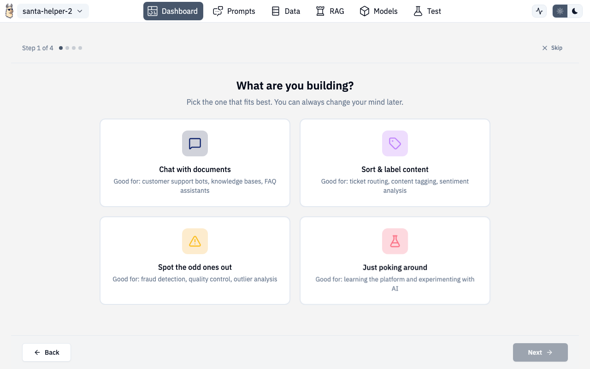

# Getting Started

When you open a project for the first time, the Designer walks you through an onboarding wizard that builds a personalized getting-started checklist based on your goals.

## Onboarding Wizard

The wizard asks four quick questions to understand what you're building:

### Step 1: Project Type

Choose what kind of AI project you're building:

| Type | Description |
|---|---|
| **Chat with documents** | Customer support bots, knowledge bases, FAQ assistants |
| **Classify text** | Sentiment analysis, ticket routing, content categorization |
| **Detect anomalies** | Fraud detection, system monitoring, quality control |
| **Summarize documents** | Report generation, meeting notes, research digests |
| **Just exploring** | Not sure yet — see what's possible |

### Step 2: Data Status

Tell the wizard about your data:

- **Use sample data** — pick from built-in demo datasets matched to your project type
- **I have my own data** — upload files directly in the wizard (drag-and-drop supported)
- **No data yet** — skip for now, add data later

When uploading your own data, you can name your dataset and add multiple files right in the wizard.

### Step 3: Deploy Target

Where will this run?

- **On my own turf** — local machine, on-prem, or air-gapped
- **Up in the cloud** — AWS, GCP, Azure
- **Haven't decided yet** — no worries

### Step 4: Experience Level

How much guidance do you want?

- **Hold my hand** — step-by-step walkthroughs
- **Just nudge me along** — know the basics, need direction
- **Get out of my way** — just the checklist

### Completion

After answering, the wizard generates a personalized checklist and transitions you to the dashboard. A brief loading animation shows while your guide is being built.

You can skip the wizard at any time by pressing **Escape** or clicking the X button.

## Getting Started Checklist

After the wizard completes, a checklist appears at the top of the dashboard with steps tailored to your project type and experience level.

### How it works

- Each step has a checkbox, title, and a link to the relevant section
- Clicking a step's link navigates you to the right page
- Steps auto-complete when you finish the action (e.g., uploading data marks "Add data" complete)
- You can manually check steps off too
- Confetti fires when you complete a step 🎉
- Collapse the checklist to a compact progress bar when you don't need it

### Checklist Navigator

When you navigate away from the dashboard via a checklist link, a floating navigator appears showing:

- Which checklist step you're on
- Progress through the overall checklist
- Quick navigation back to the dashboard or to the next step
- Contextual tips for the current page

### Restarting the Wizard

If you skipped or dismissed the wizard, a banner on the dashboard lets you restart it anytime. Click **"Set up my guide"** to re-run the wizard with fresh answers.
