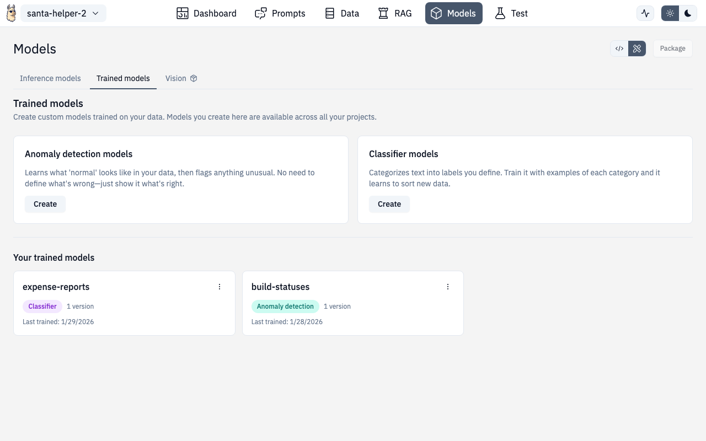

# ML Training



The Designer includes built-in tools for training classifiers and anomaly detection models — no ML expertise required. These run on the Universal Runtime.

## Text Classifiers

Train a text classifier using SetFit (few-shot fine-tuning). Great for sentiment analysis, ticket routing, content categorization, and more.


### How It Works

1. **Choose a base model** — select an embedder model (default: `all-MiniLM-L6-v2`)
2. **Add training data** — enter text/label pairs, or use a sample dataset
3. **Train** — click Train and watch progress in real-time
4. **Test** — enter text and see predictions with confidence scores

### Available Base Models

| Model | Dimensions | Notes |
|---|---|---|
| `all-MiniLM-L6-v2` | 384 | Default, fast, good general purpose |
| `bge-small-en-v1.5` | 384 | Strong English performance |
| `bge-base-en-v1.5` | 768 | Larger, more accurate |
| `bge-large-en-v1.5` | 1024 | Best accuracy, slower |
| `bge-m3` | 1024 | Multilingual support |
| `e5-base-v2` | 768 | Good for retrieval tasks |
| `e5-large-v2` | 1024 | Larger variant |

### Sample Datasets

Built-in sample datasets to get started quickly:

- **Sentiment analysis** — 3 classes, 200 examples (positive/negative/neutral)
- Additional domain-specific samples available

### Managing Trained Models

The **Trained Models** view lists all your classifier models with:

- Model name and version
- Training timestamp
- Number of classes and examples
- Actions: load, test, delete

## Anomaly Detection

Train anomaly detection models using PyOD backends. Useful for fraud detection, system monitoring, quality control, and any scenario where you need to identify outliers.


### Backends

12 PyOD backends organized by category:

| Category | Backends | Best for |
|---|---|---|
| **Fast (Recommended)** | ECOD, HBOS, COPOD | General purpose, parameter-free |
| **Legacy (Well-Tested)** | Isolation Forest, LOF, KNN, OCSVM | Traditional ML approaches |
| **Deep Learning** | AutoEncoder, VAE | Complex patterns |
| **Ensemble** | SUOD, LSCP | Combining multiple detectors |

### Training Flow

1. **Select a backend** — ECOD recommended for most cases
2. **Configure features** — define feature columns with encoding types and normalization
3. **Add training data** — paste text/CSV or use table input mode
4. **Set threshold** — contamination ratio (default varies by backend)
5. **Train** — model trains and shows results

### Feature Configuration

Each feature column supports:

- **Encoding types** — numeric, one-hot, label, ordinal, binary, frequency
- **Normalization** — standard, min-max, robust, none

### Streaming Anomaly Detection

For real-time monitoring, the streaming mode provides:


- **Mode toggle** — switch between batch and streaming detection
- **Status panel** — connection status, events processed, anomalies detected
- **Results chart** — live visualization of anomaly scores over time
- **Mode panel** — configure streaming parameters

### API Routes

| Action | Method | Route |
|---|---|---|
| Train classifier | POST | `/v1/ml/classifier/fit` |
| Predict (classifier) | POST | `/v1/ml/classifier/predict` |
| List classifier models | GET | `/v1/ml/classifier/models` |
| Train anomaly model | POST | `/v1/ml/anomaly/fit` |
| Score anomaly | POST | `/v1/ml/anomaly/score` |
| List anomaly models | GET | `/v1/ml/anomaly/models` |

## Route

```
/chat/models/train/classifier/new
/chat/models/train/classifier/:id
/chat/models/train/anomaly/new
/chat/models/train/anomaly/:id
```
