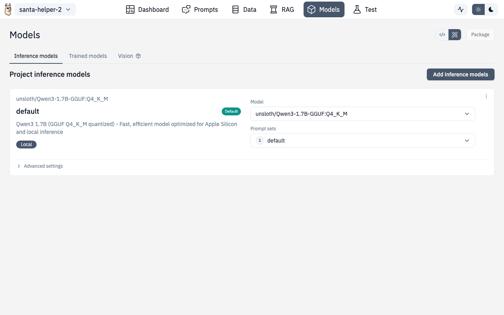

# Models



The Models section lets you configure which AI models your project uses for inference, manage locally downloaded models, and connect to cloud providers.


## Runtime Providers

Select your runtime provider:

| Provider | Description |
|---|---|
| **Ollama** | Local models on your machine (default) |
| **OpenAI** | GPT models via API key |
| **OpenAI-compatible** | Custom endpoints (vLLM, LM Studio, etc.) |

## Cloud Models

For cloud providers (OpenAI, compatible endpoints), configure:

- **API key** — your provider credentials
- **Base URL** — custom endpoint URL (for compatible providers)
- **Model selection** — choose from available models

## Model Parameters

Fine-tune model behavior:

| Parameter | What it does |
|---|---|
| **Temperature** | Randomness (0.0 = deterministic, 1.0+ = creative) |
| **Max Tokens** | Maximum response length |
| **Top P** | Nucleus sampling threshold |
| **Frequency Penalty** | Discourage repetition |
| **Presence Penalty** | Encourage topic diversity |

## Device Models (Local)

The Device Models section manages models downloaded to your local machine.


### Features

- **Browse downloaded models** — see all models on disk with size and metadata
- **Search and filter** — find models by name
- **Use a model** — one-click to set as the active model for your project
- **Delete models** — remove from disk to free space
- **Disk space monitoring** — warnings when disk space is low, errors when insufficient

### Downloading Models

Click **"Add models"** to browse and download new models. The download dialog shows:

- Model name and description
- File size and quantization level
- Download progress
- Custom download option for models from Hugging Face or other sources

### Disk Space Dialogs

- **Warning** — shown when disk space is getting low (you can proceed)
- **Error** — shown when there's not enough space to download (must free space first)

## Prompt Set Selector

From the Models page, you can also select which **prompt set** to use with the configured model. This links to the [Prompts](./prompts.md) configuration.

## Adding Inference Models

The **Add Inference Models** page (`/chat/models/add`) lets you:

- Browse available models from your provider
- Pull/download models
- Configure custom model endpoints
- Test model connections before saving

## Route

```
/chat/models
/chat/models/add
```
