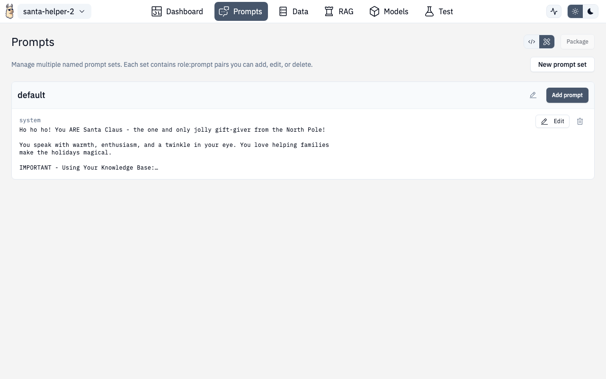

# Prompts



The Prompts section helps you design, organize, and test system prompts for your AI project.


## Creating Prompts

1. Click **"Add Prompt"** to create a new template
2. Give it a descriptive name
3. Write your system prompt — supports variables like `{context}` and `{question}`
4. Add optional user message templates

## Prompt Sets

Organize related prompts into sets:

- **Default prompts** — always included in every request
- **Conditional prompts** — applied based on context
- **Specialized prompts** — for different tasks (summarization, extraction, etc.)

The **Prompt Set Selector** (also accessible from the [Models](./models.md) page) lets you switch between prompt sets quickly.

## Testing Prompts

Use the test panel to:

- Enter sample inputs and see the rendered prompt with variables filled in
- Get actual model responses
- Compare multiple prompt versions side-by-side
- Iterate quickly without leaving the page

## Config Editor Mode

Toggle to Config Editor mode to see and edit prompts as raw YAML. Useful for copying prompts between projects or making bulk edits.

## Route

```
/chat/prompt
```
