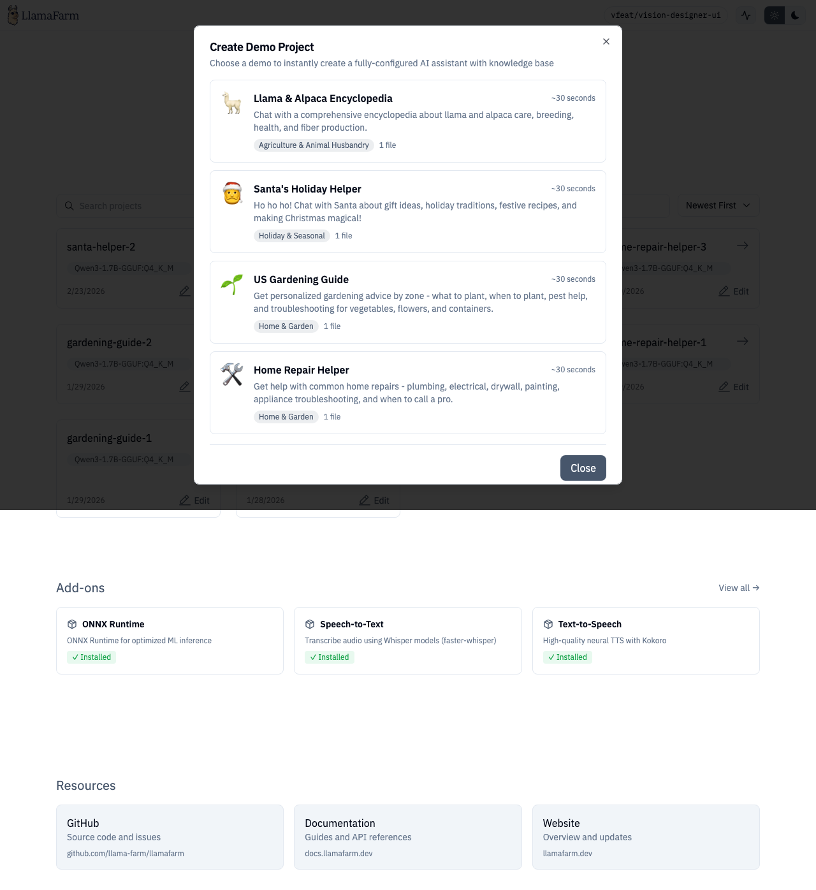

# Samples & Demos

LlamaFarm includes pre-built sample projects and guided demos to help you get started quickly and learn how different features work together.

## Sample Projects

The Samples page shows a gallery of ready-made projects you can import.


### Available Samples

Each sample card shows:

- **Title and description** — what the project does
- **Primary model** — which LLM it's configured for
- **Tags** — categorization (maintenance, fleet, ops, etc.)
- **Download size** — how much data to fetch
- **Dataset count** — number of included datasets

### Importing a Sample

Click a sample card to preview it, then choose:

- **Import as project** — creates a new project with the sample's full configuration, prompts, and strategies. You can customize the name and description.
- **Import data only** — imports just the datasets into an existing project. Choose whether to create a new dataset or add to an existing one, and whether to include processing strategies.

### Example Projects

| Project | Description | Model |
|---|---|---|
| Aircraft Maintenance Assistant | Fault diagnosis from offline manuals and flight logs | TinyLlama |
| *(and more)* | Browse the full gallery in the Designer | Various |

## Guided Demos



Demos are interactive walkthroughs that create a working project step-by-step, showing you the API calls happening in real-time.


### How Demos Work

1. Click **"Try a demo"** (available from the home page)
2. Select a demo from the gallery — each shows description, category, estimated time, and file count
3. Watch as the demo:
   - Creates a project
   - Uploads sample files
   - Configures processing strategies
   - Processes data
   - Shows each API call with expandable request/response details
4. When complete, you have a fully working project to explore

### Available Demos

Demos are organized by category and matched to project types. Each demo includes:

- Pre-configured `llamafarm.yaml`
- Sample data files
- Sample questions to try after setup

Demos can also link directly to model training pages (classifier, anomaly) with sample data pre-loaded.

## Route

```
/samples
```
