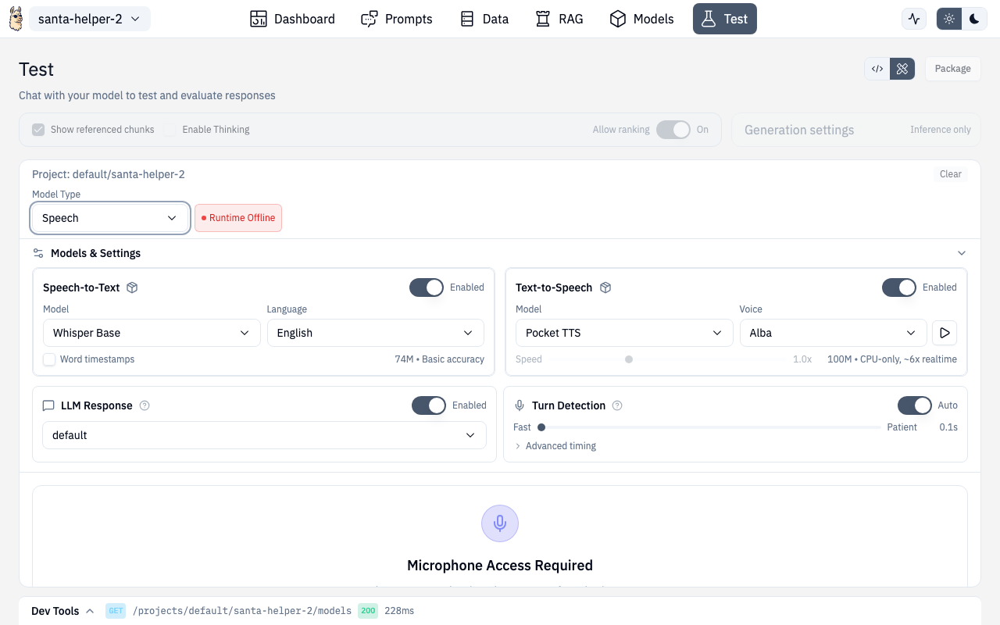

# Speech



The Speech panel provides speech-to-text (STT), text-to-speech (TTS), voice cloning, and full voice conversation capabilities. These features require the speech addons to be installed (see [Addons](./addons.md)).


## Speech-to-Text (STT)

Record audio and get transcriptions:

- **Model selection** — choose from available Whisper models (base, small, medium, large)
- **Language** — set the source language for better accuracy
- **Word timestamps** — optionally get per-word timing data
- **Live waveform** — visualize audio input in real-time

### Recording

Click the microphone button to start recording. The waveform visualization shows audio levels in real-time. Click stop when done, and the transcription appears below.

If microphone access hasn't been granted, a permission prompt guides you through enabling it.

## Text-to-Speech (TTS)

Convert text to spoken audio:

- **Model selection** — choose from available TTS models (e.g., `pocket-tts`)
- **Voice selection** — pick from available voices for the selected model
- **Audio playback** — listen to generated audio with built-in player
- **History** — previous TTS generations are kept for reference

## Voice Cloning

Create custom voices from audio samples:


- Record or upload a voice sample
- Clone the voice for use with TTS
- Use cloned voices in conversation mode

## Conversation Mode

Full voice-to-voice conversation with your AI:

- **Turn detection** — configurable settings for when the AI should start responding
- **Continuous conversation** — alternating speech turns with the AI
- **Conversation view** — see the full transcript with speaker labels
- **Model integration** — uses your project's configured inference model for responses

### Turn Detection Settings

Configure how the system detects when you've stopped talking:

- Silence threshold
- Minimum speech duration
- Response delay

## Requirements

Speech features require the **Universal Runtime** (port 11540) to be running. The panel checks runtime health automatically and shows status badges for STT/TTS availability.

If addons aren't installed, an inline prompt lets you install them directly or navigate to the [Addons](./addons.md) page.

## API Routes

| Action | Method | Route |
|---|---|---|
| Transcribe audio | POST | `/v1/audio/transcriptions` (Universal Runtime) |
| Synthesize speech | POST | `/v1/{ns}/{project}/audio/speech` |
| List voices | GET | `/v1/{ns}/{project}/audio/voices` |
| Stream transcription | WebSocket | `/v1/audio/transcriptions/stream` (Universal Runtime) |

## Route

Speech is accessed through the Test page in speech mode:

```
/chat/test (select Speech mode)
```
