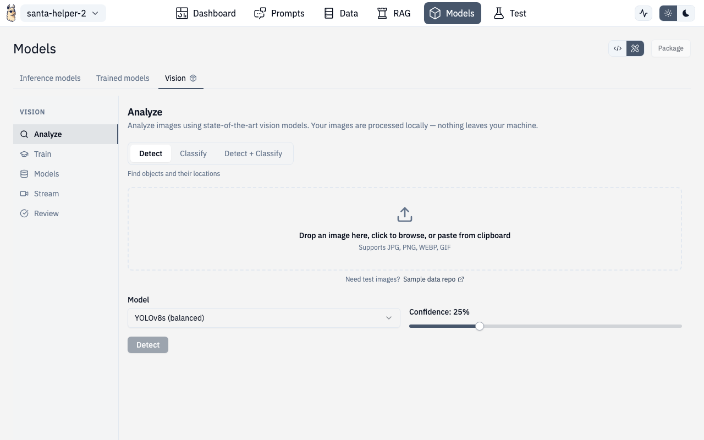

# Vision



The Vision panel provides OCR, image analysis, object detection with bounding boxes, model training, and real-time streaming detection.


## Tabs

The Vision panel has five sub-sections accessible via a left sidebar:

### Analyze

Upload and analyze images:

- Drag-and-drop or click to upload images
- Run OCR to extract text from images
- Get image descriptions and analysis
- View results alongside the original image

### Train

Train custom vision models:

- Upload training images with annotations
- Draw bounding boxes on images using the interactive canvas
- Define object classes
- Configure training parameters
- Monitor training progress


### Models

Manage saved vision models:

- View all trained models
- Load a model for inference
- Delete models you no longer need
- Navigate to training to create new models

### Stream

Real-time detection using a trained model:

- Connect to a video feed or webcam
- Run continuous object detection
- See bounding boxes overlaid in real-time
- Monitor detection confidence scores

### Review

Review detection results:

- Browse past detection runs
- Verify accuracy of detections
- Filter by confidence threshold
- Export results

## Bounding Box Canvas

The interactive canvas component supports:

- Drawing new bounding boxes by click-and-drag
- Resizing existing boxes
- Labeling boxes with class names
- Zooming and panning on large images
- Undo/redo

## API Routes

| Action | Method | Route |
|---|---|---|
| Detect objects | POST | `/v1/vision/detect` |
| Classify image | POST | `/v1/vision/classify` |
| Detect + Classify | POST | `/v1/vision/detect_classify` |
| OCR | POST | `/v1/vision/ocr` |
| Train model | POST | `/v1/vision/train` |
| List models | GET | `/v1/vision/models` |

## Route

Vision is accessed through the Test page in vision mode:

```
/chat/test (select Vision mode)
```
